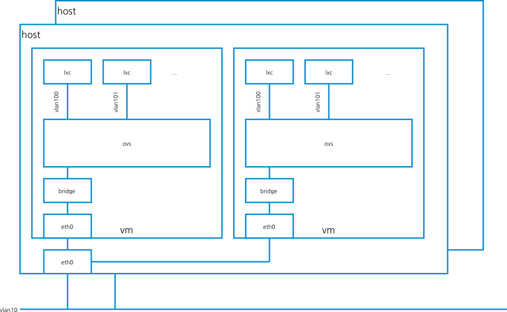

#docker_with_sliced_network#

Docker with sliced networks on vagrant environment.

##Goal##

To provide testing linux containers on sliced networks.

##Requirements##
- [vagrant](http://www.vagrantup.com/)
    - vagrant-serverspec
        - `vagrant plugin install vagrant-serverspec`
- [docker](https://www.docker.io/)
- [Chef](http://www.getchef.com/chef/)
- [serverspec](http://serverspec.org/)
- [Open vSwitch](http://openvswitch.org/)

##TODOs##
- [x] install openvswitch
- [x] install docker
- [x] draw a simple network chart
- [ ] configure openvswitch to use vlan
- [ ] ...

##References##

- [n40lab: CentOS 6.4 – Openvswitch installation](http://n40lab.wordpress.com/2013/06/03/centos-6-4-openvswitch-installation/)
- [PaaS: Coupling Docker and Open vSwitch](http://fbevmware.blogspot.jp/2013/12/coupling-docker-and-open-vswitch.html)
